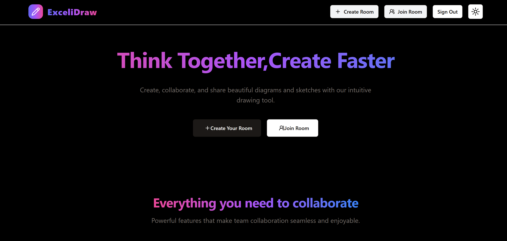

🖌️ Collaborative Draw App

A real-time collaborative drawing application where multiple users can draw together on a shared canvas. Every shape’s logic has been implemented from scratch. The app supports sharing boards, zooming, and panning for a smooth creative experience.

🚀 Features
🔗 Real-time Collaboration – multiple users can draw together on the same board.

📤 Sharable Board – generate a link and invite others.

🔍 Zooming & Panning – navigate large drawings with ease.

🖼️ Shapes from Scratch – implemented drawing logic for:

Line

Rectangle

Circle

Free-hand Drawing (Pen/Brush)

✏️ Editing Tools – erase, clear canvas, change stroke color & thickness.

💾 Save & Export – download your artwork as an image.

🎨 Smooth UI – responsive design with clean layout.

📸 Screenshots

  
  
  
  

🛠️ Tech Stack
Frontend: Next.js (with TypeScript)

Backend: Express + WebSocket

Database: PostgreSQL

Architecture: Monorepo structure for managing frontend & backend together

Others: Canvas API

⚡ Getting Started
1. Clone the repository
git clone https://github.com/your-username/collaborative-draw-app.git
cd collaborative-draw-app
2. Install dependencies
npm install
3. Run the development server
npm run dev
Your app will be running at http://localhost:3000 🎉
